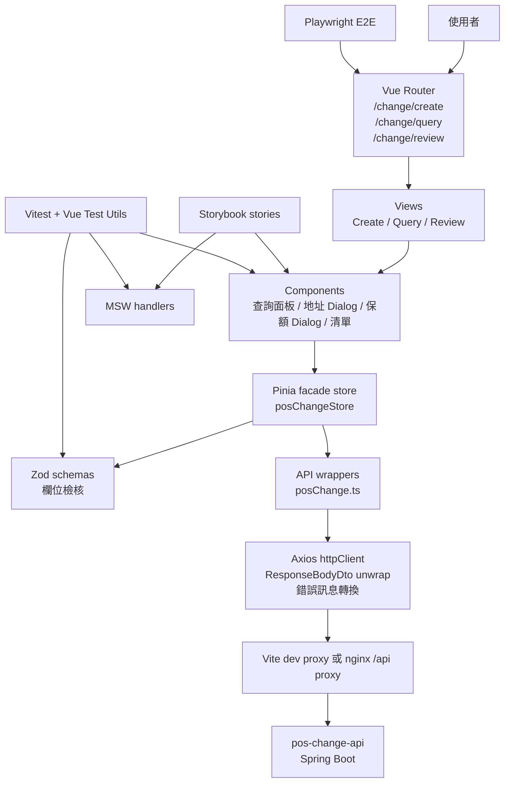

# POS Change Web 命名整理

## 命名原則

前端 type 名稱要描述 UI 實際使用的資料，不只描述某一支 API 的回覆。共用 payload type 不應命名成一次性的 `Response` class，除非它真的代表回覆外層格式。

## 回覆外層

只使用一個回覆包裝名稱：

- `ResponseBodyDto<T>`：後端回覆外層。

Request payload 不要包 `ResponseBodyDto`。

## 前端共用 Types

目前 `src/api/posChange.ts` 中的共用 UI/API payload 名稱：

- `PolicyMaster`：保單主檔資料。
- `PolicyAddress`：保單地址資料。
- `PolicyRide`：保單附約或主約附約列資料。
- `CodeDescription`：變更項目標籤用的代碼資料。
- `PolicyDetail`：保單查詢結果，新增頁與編輯 Dialog 共用。
- `ChangeCase`：新產生的案號資料。
- `PolicyChangeCase`：查詢與覆核頁使用的既有受理資料列。
- `PostalCodeArea`：3+3 郵遞區號查詢結果，供地址變更 Dialog 帶入地址前綴。

這些名稱刻意不使用 `*Response`，因為同一份資料會被頁面狀態、Dialog、表格與覆核動作共用。

## 先前重新命名方向

後端 DTO 已從 response-only 命名調整為共用命名。前端也應採用同樣概念：

- 避免在前端 state 使用 `PolicyDetailResponse`。
- 使用 `PolicyDetail` 表示保單查詢資料。
- 避免在前端 state 使用 `CreateChangeCaseResponse`。
- 使用 `ChangeCase` 表示產生案號資料。
- 只有需要 `changedFieldCount` 時，避免建立 `AddressChangeResponse`。
- 若後續重複使用，再建立共用 change-result type。

## 變更項目命名

商業代碼在 API payload 與判斷中維持數字字串：

- `001`：地址變更。
- `002`：主約保額變更。
- `003`：附約保額變更。

UI 標籤可以顯示中文，但 request payload value 應維持數字代碼。

## 保額 Dialog 命名

`002` 與 `003` 共用同一個保額 Dialog，由模式決定行為：

- `amountDialogType = 'main'`：顯示主檔保額，並呼叫主約保額 API。
- `amountDialogType = 'rider'`：顯示附約清單，並呼叫附約保額 API。

附約保額 payload 必須包含 `rideOrder`，這是後端用來更新正確資料列的 key。

## API 與畫面註解

`src/api/posChange.ts` 的每個 API wrapper 上方或函式內第一行應保留簡短註解，標示對應畫面或 Dialog，例如：

- 新增保全變更頁。
- 地址變更 Dialog。
- 查詢保全變更頁。
- 覆核頁。

註解只說明畫面對應與用途，不寫過度細節。

## 地址與總保費命名

- `PostalCodeArea.addressPrefix`：中文地址前綴。
- `PostalCodeArea.halfWidthAddressPrefix`：保留相容舊欄位，地址變更畫面不再寫入 `email / 電話 / 手機`。
- 地址變更畫面郵遞區號分成 `zipCode3` 與 `zipCode2` 兩個欄位；`zipCode3` 必填 3 碼，`zipCode2` 可空白，若填寫需為 3 碼。
- `zipCode3` 輸滿 3 碼後自動 focus `zipCode2`；`zipCode2` 輸滿 3 碼後自動 focus 地址。
- 選擇 `01/02` 時開啟郵遞區號與地址欄位，鎖住 `email / 電話 / 手機`；選擇其他地址型態時反向鎖住地址欄位。
- 聯絡資料會優先顯示目前資料列可見的 email/電話/手機；未修改直接儲存時，後端應回傳 `changedFieldCount = 0`。
- 重新輸入 `zipCode3` 時會清空 `zipCode2` 與舊地址內容，再依新的前三碼帶入 code table 地址前綴。
- 若郵遞區號 API 暫時無回應，前端會嘗試由目前保單地址清單中相同 `zipCode3` 的地址推導前綴。
- `PolicyMaster.premium`：總保費，不是可直接編輯的保費欄位。
- 前端顯示文字使用「總保費」，避免誤解為單一主約保費。

## 狀態命名

受理狀態值：

- `P`：受理中，顯示為 `P - 受理中`。
- `S`：完成，顯示為 `S - 完成`。
- `C`：取消，顯示為 `C - 取消`。

只有覆核頁應呼叫狀態更新 API。

## 架構流程圖



正式畫面流程以 `Vue Router -> Views -> Components -> Pinia -> Zod/API -> Backend` 為主；測試與 Storybook 透過 MSW 模擬後端，避免只為看元件就必須啟動後端。

## 檔案職責

- `src/App.vue`：外層版面、左側選單與 `<RouterView />`。
- `src/router/index.ts`：前端路由定義。
- `src/stores/posChangeStore.ts`：Pinia facade store，集中串接頁面狀態與主要 action。
- `src/api/posChange.ts`：API 呼叫與共用 TypeScript types。
- `src/api/httpClient.ts`：Axios client、`ResponseBodyDto` unwrap 與 HTTP 錯誤訊息轉換。
- `src/schemas/changeCaseSchemas.ts`：Zod 表單檢核規則，包含保單查詢、地址變更、主約保額與附約保額。
- `src/mocks/handlers.ts`：MSW API mock，供 Vitest 與 Storybook 共用。
- `src/test/setup.ts`：Vitest 測試初始化。
- `e2e/`：Playwright E2E 測試。
- `src/utils/format.ts`：只放通用格式化或純判斷，不放 SQL code table 的中文對照。
- `src/views/CreateChangeView.vue`：新增保全變更頁。
- `src/views/ChangeCaseListView.vue`：查詢與覆核共用清單。
- `src/views/QueryChangeView.vue`：查詢保全變更頁。
- `src/views/ReviewChangeView.vue`：覆核頁。
- `src/style.scss`：版面與視覺樣式。
- `src/main.ts`：Vue app bootstrap。
- `vite.config.ts`：Vite 與後端 proxy 設定。

## 前端品質工具

目前已導入以下工具：

- ESLint：檢查 Vue/TypeScript 程式品質。
- Prettier：統一格式。
- Vitest：單元測試。
- Vue Test Utils：Vue component 測試。
- MSW：mock API。
- Playwright：E2E 測試。
- Zod：表單欄位檢核 schema。
- Storybook：元件狀態展示。

常用指令：

```bash
npm run lint
npm run format:check
npm run test:unit
npm run test:e2e
npm run build
npm run build-storybook
```

## Docker

前端 Docker image 使用多階段建置：

1. `node:24-alpine` 執行 `npm ci` 與 `npm run build`。
2. `nginx:1.29-alpine` 提供靜態檔案。
3. `nginx.conf` 將 `/api/` 代理到 `http://pos-change-api:8081/api/`。

建置 image：

```bash
docker build -t anilin906622/pos-web:latest .
```

本機執行：

```bash
docker run --rm -p 8080:80 anilin906622/pos-web:latest
```

若要讓容器內 nginx 連到另一個後端位置，需調整 `nginx.conf` 或在部署平台以同名 service `pos-change-api:8081` 提供後端。

## 優化分工原則

- Zod 管欄位規則。
- Pinia 管頁面狀態與流程。
- API 層管後端溝通與錯誤訊息轉換。
- 元件只管畫面與使用者互動。
- MSW 提供測試與 Storybook 的假後端。
- Playwright 只放關鍵流程測試，不取代單元測試。

目前 `posChangeStore` 保留為 facade store；後續若流程持續變大，可逐步拆成：

1. `policyStore`：保單查詢與保單資料。
2. `changeCaseStore`：案號、案件清單與覆核。
3. `addressChangeStore`：地址 Dialog 狀態。
4. `amountChangeStore`：002/003 保額 Dialog 狀態。
