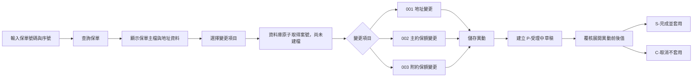
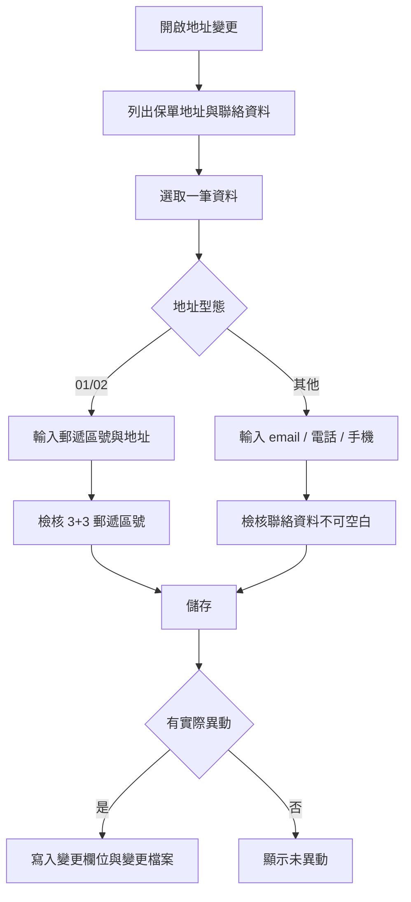
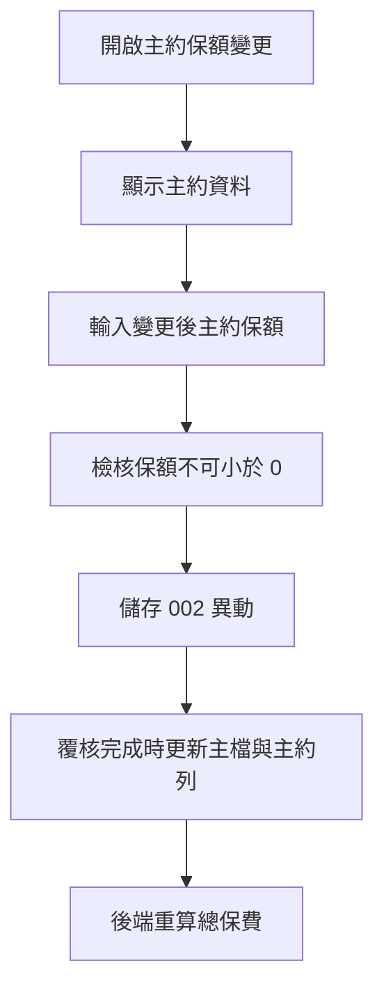
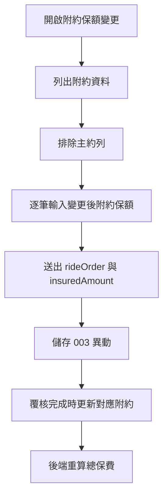
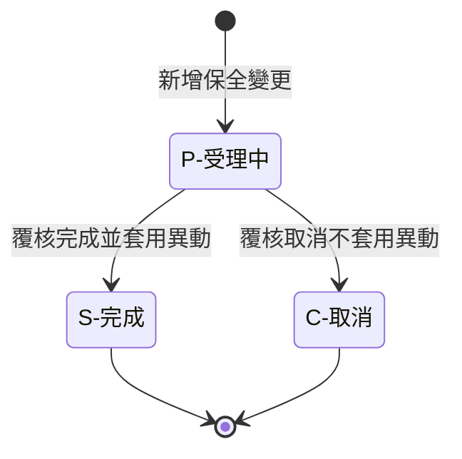
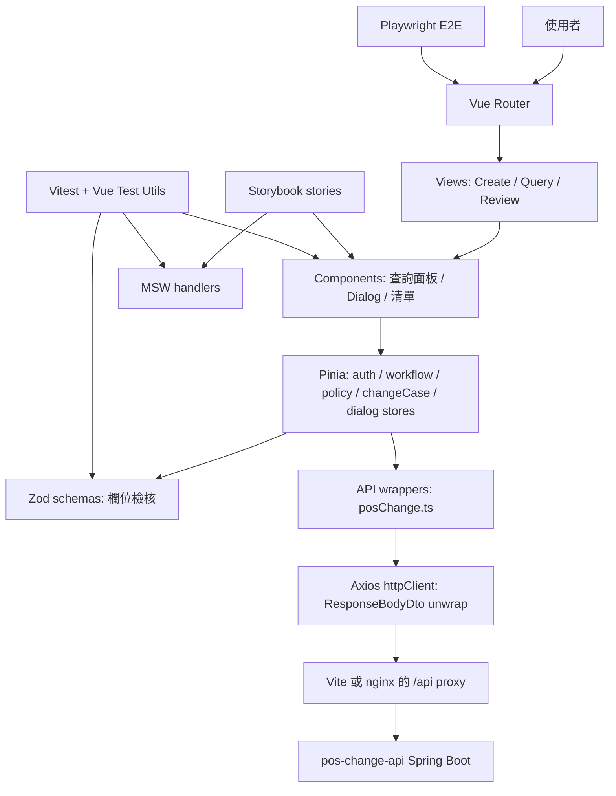

# POS Change Web 保全變更前端

`pos-web` 是 POS 保全變更作業的前端畫面，提供保單查詢、保全變更新增、保全案件查詢與覆核操作。README 前段以使用者與 IT 可理解的功能流程為主，後段再描述設計風格、架構與開發工具。

## 畫面說明

### 整體作業流程



### 登入與角色

正式環境開啟後端 Security 時，前端會先顯示登入頁：

- `MAKER`：新增、查詢與儲存保全變更。
- `REVIEWER`：查詢案件明細並完成或取消案件。
- 帳號密碼只保留在目前瀏覽器記憶體，重新整理後需重新登入。
- 本機 `VITE_API_SECURITY_ENABLED=false` 時不顯示登入頁，方便開發與 Storybook 驗證。

### 左側選單

畫面左側提供三個作業入口：

- `新增保全變更`：建立新的保全變更案號，並進行地址或保額異動。
- `查詢保全變更`：依保單號碼查詢既有保全受理資料。
- `覆核`：將受理中的案件改為完成或取消，並由後端套用或略過異動資料。

### 新增保全變更頁

使用者輸入 `保單號碼` 與 `序號` 後查詢保單。查詢成功後，畫面顯示：

- 保單主檔摘要。
- 通訊地址。
- 保單地址清單。
- 主附約資料。
- 可選擇的變更項目。

使用者選擇 `001`、`002` 或 `003` 後點擊 `產生案號`。後端只在流水號表保留案號；直到儲存時確認有實際異動，才建立 `P - 受理中`、變更項目、欄位與檔案資料。

### 001 地址變更 Dialog



地址變更會先列出該保單關聯的地址與聯絡資料。使用者先選取要異動的一筆資料，再編輯欄位：

- 選擇 `01/02` 地址型態時，開啟郵遞區號與地址欄位，鎖住 `email / 電話 / 手機`。
- 選擇其他地址型態時，開啟 `email / 電話 / 手機`，鎖住郵遞區號與地址欄位。
- 郵遞區號分成前 3 碼與後 3 碼，前 3 碼必填，後 3 碼可空白。
- 前 3 碼輸滿後自動跳到後 3 碼；後 3 碼輸滿後自動跳到地址。
- 重新輸入前 3 碼時，會清空後 3 碼與舊地址內容，再重新帶入縣市區前綴。

儲存成功後 Dialog 會關閉；若沒有實際異動，畫面顯示未異動訊息。

### 002 主約保額變更 Dialog



主約保額變更使用共用保額 Dialog 的 `main` 模式。畫面顯示目前主約資料與可修改的變更後保額。總保費不可在前端直接修改，覆核完成時由後端依主附約保費加總回寫。

### 003 附約保額變更 Dialog



附約保額變更使用共用保額 Dialog 的 `rider` 模式。畫面列出附約資料並排除主約列，使用者可逐筆修改附約保額。送出資料時會帶 `rideOrder`，避免同一保單有多筆附約時改到錯誤資料。

### 查詢保全變更頁

使用者輸入保單號碼後，畫面列出該保單既有保全受理資料，包含案號、序號、受理狀態、變更項目與中文說明。此頁只查詢，不允許改狀態。

### 覆核頁



覆核頁與查詢頁共用清單呈現。使用者必須先點擊明細圖示，查看每個 `changeField / changeKey` 及異動前後值；只有覆核頁的明細區會顯示狀態操作：

- 改為 `S - 完成`：後端將變更內容套用到保單主檔、主附約或地址資料。
- 改為 `C - 取消`：後端只更新案件狀態，不套用異動資料。

已完成或已取消案件不可再次覆核。

完成前會再次顯示確認對話框。後端使用 `P -> A -> S` 的原子狀態流程，並確認主檔目前值仍等於草稿異動前值；若其他案件已先更新同一資料，畫面會收到 `409` 衝突訊息，不會覆蓋較新的資料。

## 功能代碼與狀態

### 變更項目

- `001`：地址變更。
- `002`：主約保額變更。
- `003`：附約保額變更。

### 受理狀態

- `P`：受理中，顯示為 `P - 受理中`。
- `S`：完成，顯示為 `S - 完成`。
- `C`：取消，顯示為 `C - 取消`。

新增保全變更只會建立 `P - 受理中` 案件。只有覆核頁可以將 `P` 改為 `S` 或 `C`。

## 主要操作規則

- 案號由資料庫原子取得，支援服務重啟與多 Pod；流水號至少三碼且可成長到四碼以上。
- 案號可以先取得，但只有儲存時真的有異動，後端才會寫入受理資料、變更項目、變更欄位與變更檔案。
- 同一目標重複儲存會替換最新草稿；改回原值會刪除該目標草稿，不會保留過期異動。
- 地址變更若沒有實際異動，畫面顯示未異動訊息，不應產生異動欄位筆數。
- `01/02` 地址型態使用郵遞區號與地址欄位；其他地址型態使用 `email / 電話 / 手機` 欄位。
- 郵遞區號採前 3 碼與後 3 碼，後 3 碼可空白。
- 主約保額與附約保額分別由 `002`、`003` 處理。
- 附約保額送出時必須包含 `rideOrder`，避免同一保單多筆附約時更新錯誤資料。
- 總保費不可由前端直接修改，覆核完成時由後端依主附約檔保費加總回寫。

## 技術套件與工具

本專案前端使用 Vue 3 與 Vite 開發，並導入以下套件與工具：

- ESLint：檢查 Vue/TypeScript 程式品質。
- Prettier：統一格式。
- Vitest：單元測試。
- Vue Test Utils：Vue component 測試。
- MSW：mock API。
- Playwright：E2E 測試。
- Zod：表單欄位檢核 schema。
- Storybook：元件狀態展示。
- GitHub Actions：自動執行格式、Lint、單元測試、建置、Storybook 與 Playwright。
- Docker Compose：一起啟動 MySQL、Spring Boot API 與 nginx 前端。

## 設計風格

- 畫面以作業型系統為主，採左側選單與右側工作區，避免過度裝飾。
- 查詢、建立案號、儲存、覆核等主要動作使用清楚按鈕與狀態訊息。
- 地址與保額編輯使用 Dialog，避免使用者離開目前保單上下文。
- 欄位檢核先在前端提示，後端仍保留最終資料檢核。
- 前端顯示文字以業務可理解為優先，例如「總保費」、「受理中」、「完成」、「取消」。

## 優化分工原則

- Zod 管欄位規則。
- Pinia 管頁面狀態與流程。
- API 層管後端溝通與錯誤訊息轉換。
- 元件只管畫面與使用者互動。
- MSW 提供測試與 Storybook 的假後端。
- Playwright 只放關鍵流程測試，不取代單元測試。

Pinia 已依責任拆分：

1. `workflowStore`：loading、成功與錯誤訊息。
2. `authStore`：登入資料與 MAKER / REVIEWER 角色。
3. `policyStore`：保單查詢、主檔、地址與代碼。
4. `changeCaseStore`：案號、案件清單、覆核明細與狀態更新。
5. `addressChangeStore`：001 Dialog、郵遞區號與地址草稿。
6. `amountChangeStore`：002/003 共用 Dialog 與保額草稿。

元件不再依賴單一大型 facade store；跨 Store 的動作只在 action 執行時取得其他 Store，避免模組初始化時互相讀取。

Pinia 的寫入邊界採混合方式：

- API 回傳、登入角色、案件狀態與 loading/error 由元件唯讀使用，只能由 Store action 更新。
- 查詢條件與 Dialog 表單是使用者尚未送出的暫存輸入，可保留可寫，或在元件內維護。
- Store action 負責 API 與畫面流程協調；是否有異動、案號、P/A/S/C 與覆核交易等保全規則仍以後端為唯一準則。
- 不把全部 state 強制包成 `readonly`；否則只會增加 `v-model` 樣板，並不會取代後端商業檢核。

## 命名原則

前端 type 名稱要描述 UI 實際使用的資料，不只描述某一支 API 的回覆。共用 payload type 不應命名成一次性的 `Response` class，除非它真的代表回覆外層格式。

## 回覆外層

只使用一個回覆包裝名稱：

- `ResponseBodyDto<T>`：後端回覆外層。

Request payload 不要包 `ResponseBodyDto`。

## 前端共用 Types

目前 `src/api/posChange.ts` 中的共用 UI/API payload 名稱：

- `PolicyMaster`：保單主檔資料。
- `PolicyAddress`：保單地址資料。
- `PolicyRide`：保單附約或主約附約列資料。
- `CodeDescription`：變更項目標籤用的代碼資料。
- `PolicyDetail`：保單查詢結果，新增頁與編輯 Dialog 共用。
- `ChangeCase`：新產生的案號資料。
- `PolicyChangeCase`：查詢與覆核頁使用的既有受理資料列。
- `PostalCodeArea`：3+3 郵遞區號查詢結果，供地址變更 Dialog 帶入地址前綴。

這些名稱刻意不使用 `*Response`，因為同一份資料會被頁面狀態、Dialog、表格與覆核動作共用。

## 先前重新命名方向

後端 DTO 已從 response-only 命名調整為共用命名。前端也應採用同樣概念：

- 避免在前端 state 使用 `PolicyDetailResponse`。
- 使用 `PolicyDetail` 表示保單查詢資料。
- 避免在前端 state 使用 `CreateChangeCaseResponse`。
- 使用 `ChangeCase` 表示產生案號資料。
- 只有需要 `changedFieldCount` 時，避免建立 `AddressChangeResponse`。
- 若後續重複使用，再建立共用 change-result type。

## 變更項目命名

商業代碼在 API payload 與判斷中維持數字字串。UI 標籤可以顯示中文，但 request payload value 應維持數字代碼。

## 保額 Dialog 命名

`002` 與 `003` 共用同一個保額 Dialog，由模式決定行為：

- `amountDialogType = 'main'`：顯示主檔保額，並呼叫主約保額 API。
- `amountDialogType = 'rider'`：顯示附約清單，並呼叫附約保額 API。

附約保額 payload 必須包含 `rideOrder`，這是後端用來更新正確資料列的 key。

## API 與畫面註解

`src/api/posChange.ts` 的每個 API wrapper 上方或函式內第一行應保留簡短註解，標示對應畫面或 Dialog，例如：

- 新增保全變更頁。
- 地址變更 Dialog。
- 查詢保全變更頁。
- 覆核頁。

註解只說明畫面對應與用途，不寫過度細節。

## 地址與總保費命名

- `PostalCodeArea.addressPrefix`：中文地址前綴。
- `PostalCodeArea.halfWidthAddressPrefix`：保留相容舊欄位，地址變更畫面不再寫入 `email / 電話 / 手機`。
- 地址變更畫面郵遞區號分成 `zipCode3` 與 `zipCode2` 兩個欄位；`zipCode3` 必填 3 碼，`zipCode2` 可空白，若填寫需為 3 碼。
- `zipCode3` 輸滿 3 碼後自動 focus `zipCode2`；`zipCode2` 輸滿 3 碼後自動 focus 地址。
- 選擇 `01/02` 時開啟郵遞區號與地址欄位，鎖住 `email / 電話 / 手機`；選擇其他地址型態時反向鎖住地址欄位。
- 聯絡資料會優先顯示目前資料列可見的 email/電話/手機；未修改直接儲存時，後端應回傳 `changedFieldCount = 0`。
- 重新輸入 `zipCode3` 時會清空 `zipCode2` 與舊地址內容，再依新的前三碼帶入 code table 地址前綴。
- 若郵遞區號 API 暫時無回應，前端會嘗試由目前保單地址清單中相同 `zipCode3` 的地址推導前綴。
- `PolicyMaster.premium`：總保費，不是可直接編輯的保費欄位。
- 前端顯示文字使用「總保費」，避免誤解為單一主約保費。

## 架構流程圖



正式畫面流程以 `Vue Router -> Views -> Components -> Pinia -> Zod/API -> Backend` 為主；測試與 Storybook 透過 MSW 模擬後端，避免只為看元件就必須啟動後端。

## 檔案職責

- `src/App.vue`：外層版面、左側選單與 `<RouterView />`。
- `src/router/index.ts`：前端路由定義。
- `src/stores/workflowStore.ts`：共用 loading 與訊息狀態。
- `src/stores/authStore.ts`：登入與角色權限。
- `src/stores/policyStore.ts`：保單資料與查詢條件。
- `src/stores/changeCaseStore.ts`：案號、清單、覆核明細與狀態。
- `src/stores/addressChangeStore.ts`：001 地址／聯絡資料表單。
- `src/stores/amountChangeStore.ts`：002／003 保額表單。
- `src/api/posChange.ts`：API 呼叫與共用 TypeScript types。
- `src/api/httpClient.ts`：Axios client、`ResponseBodyDto` unwrap 與 HTTP 錯誤訊息轉換。
- `src/schemas/changeCaseSchemas.ts`：Zod 表單檢核規則，包含保單查詢、地址變更、主約保額與附約保額。
- `src/mocks/handlers.ts`：MSW API mock，供 Vitest 與 Storybook 共用。
- `src/test/setup.ts`：Vitest 測試初始化。
- `e2e/`：Playwright E2E 測試。
- `src/utils/format.ts`：只放通用格式化或純判斷，不放 SQL code table 的中文對照。
- `src/views/CreateChangeView.vue`：新增保全變更頁。
- `src/views/LoginView.vue`：正式環境 Basic Auth 登入頁。
- `src/views/ChangeCaseListView.vue`：查詢與覆核共用清單。
- `src/views/QueryChangeView.vue`：查詢保全變更頁。
- `src/views/ReviewChangeView.vue`：覆核頁。
- `src/style.scss`：版面與視覺樣式。
- `src/main.ts`：Vue app bootstrap。
- `vite.config.ts`：Vite 與後端 proxy 設定。

## Docker

前端 Docker image 使用多階段建置：

1. `node:24-alpine` 執行 `npm ci` 與 `npm run build`。
2. `nginx:1.29-alpine` 提供靜態檔案。
3. `nginx.conf` 將 `/api/` 代理到 `http://pos-change-api:8081/api/`。

建置 image：

```bash
docker build -t anilin906622/pos-web:latest .
```

本機執行：

```bash
docker run --rm -p 8080:80 anilin906622/pos-web:latest
```

若要讓容器內 nginx 連到另一個後端位置，需調整 `nginx.conf` 或在部署平台以同名 service `pos-change-api:8081` 提供後端。

### 前後端一起啟動

先建立本機環境檔：

```bash
cp .env.example .env
```

修改 `.env` 的 MySQL 密碼後執行：

```bash
docker compose up --build
```

預設位置：

- 前端：`http://localhost:8080`
- API：`http://localhost:8081`
- MySQL：`localhost:3307`

停止服務：

```bash
docker compose down
```

刪除本機 MySQL volume 並重新執行全部 Flyway：

```bash
docker compose down -v
```

## 常用指令

```bash
npm run lint
npm run format:check
npm run test:unit
npm run test:e2e
npm run build
npm run build-storybook
```
