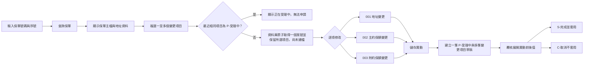
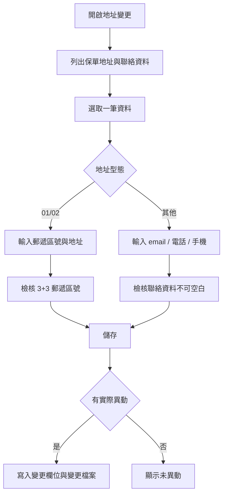
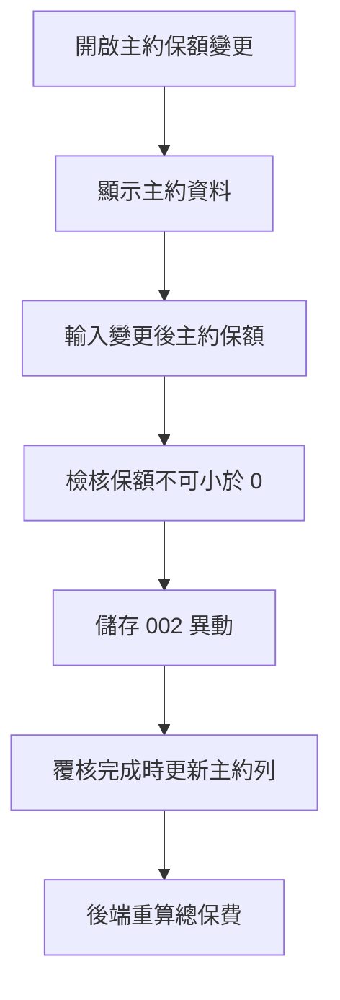
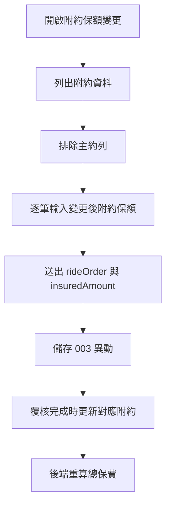
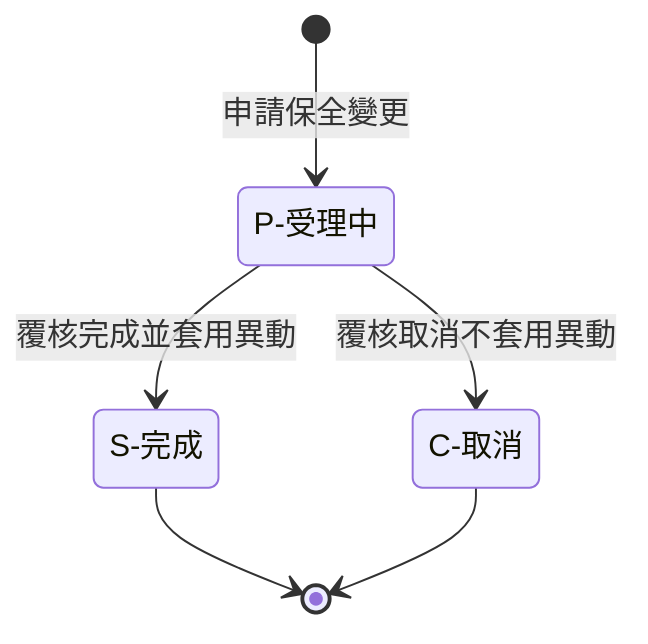
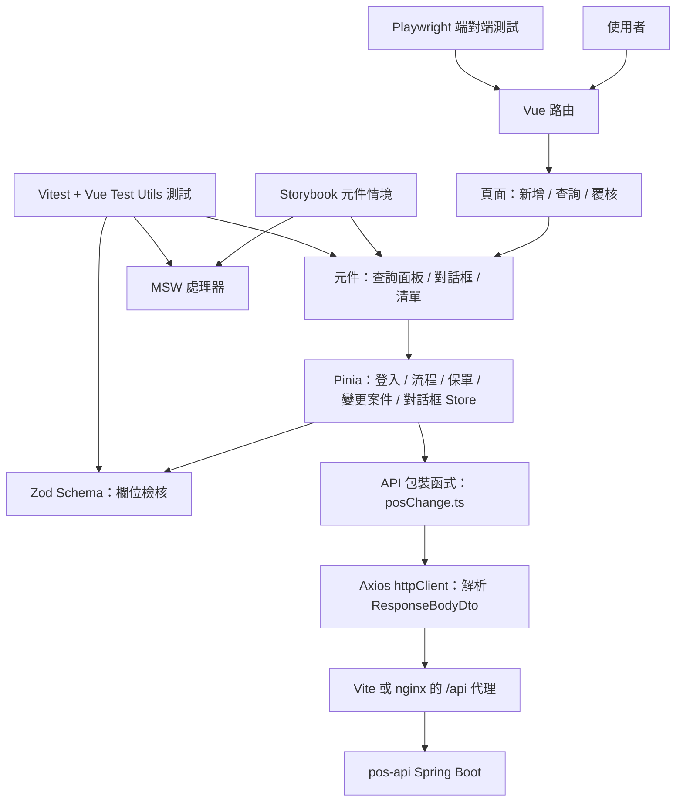

# POS Change Web 保全變更前端

使用者授權頁可由 Admin 直接建立新登入帳號，輸入使用者 ID、初始密碼、啟用狀態與角色；修改模式只調整既有帳號的啟用狀態與角色，使用者 ID 保持唯讀。密碼重設使用獨立視窗並要求輸入兩次；密碼只傳送至建立／重設 API，不保存、回顯或寫入前端狀態持久層。主清單及畫面授權明細顯示新增／更新人員與時間，覆核中心清單也顯示相同稽核欄位。

保全受理資料清單（查詢及保全覆核共用元件）固定每頁顯示 10 筆，使用共用 `PaginationBar` 切頁；重新查詢保單時回到第 1 頁，切頁不清除保單號碼。

> 資安基準請見 [`../目前所有的資安弱點.md`](../目前所有的資安弱點.md)。登入憑證只保留在分頁記憶體，重整即登出，禁止持久化到 Web Storage。

`main.code_definition` 的跨服務代碼更新由後端 MySQL/Debezium CDC 發布；前端仍透過 API 取得授權後的代碼資料，不直接連 Kafka，也不自行保存另一份永久代碼來源。

前端欄位名稱與共通業務邏輯統一查閱 [`../欄位命名規則ＤＤ定義.md`](../欄位命名規則ＤＤ定義.md)，並優先使用後端 metadata／`CHT-code` 中文名稱。`key1` 僅是跨資料來源的覆核查詢參數，不取代正式壽險欄位名稱。

前端只呈現正式資料與覆核暫存資料，不自行決定案件能否核准，也不得把 `P`／`C` 快照合併成正式資料。新增、修改、刪除、覆核與授權都由後端重新檢查權限、同 Key 處理中案件、狀態轉換及資料版本；畫面隱藏或停用按鈕僅供操作提示。

覆核詳細內容優先使用 `change_review` 保存的異動前後快照；舊資料若主檔缺值，會讀取同一 `reviewKey` 的稽核歷程快照。兩者皆無資料時明確顯示歷史資料未保存快照，不以空白畫面誤導使用者。

Maker 維護成功若 API 回傳 `reviewStatus=P`，畫面不把提案插入正式資料表，而是導向覆核中心；Admin 直接完成回傳 `S` 後才刷新正式資料。所有 API 還會由後端依 userId 的功能代碼再次授權。

既有 API／store／畫面欄位需要調整的項目請查閱 [`../專案欄位命名盤點.md`](../專案欄位命名盤點.md)，不可由個別頁面自行改名。

主約與附約共同資料的 canonical entity 是 `PolicyCoverage`，欄位為 `coverageItemType` 與 `coverageItemSeq`；中文畫面仍可顯示「保單主附約」。

代碼對照表可選取 `main-code` 的「代碼建置」索引，中文名稱由後端資料庫對照資料提供。

`pos-web` 是 POS 保單服務作業的前端畫面，提供保單查詢、保全變更新增、保全案件查詢與覆核操作。README 前段以使用者與 IT 可理解的功能流程為主，後段再描述設計風格、架構與開發工具。

### Cloudflare Quick Tunnel 測試

Vite 開發伺服器已允許 `trycloudflare.com` 子網域，供短期外部弱點掃描使用。啟動前端後執行：

```bash
cloudflared tunnel --url http://localhost:5173
```

只使用測試資料與測試帳號；掃描完成按 `Ctrl+C` 關閉 Tunnel。正式環境不使用 Vite 開發伺服器。

## Docker 正式模式與資料庫備份

Docker Compose 預設使用 `prod` profile 並要求 HTTPS。TLS 由外部反向代理或 Cloudflare 終止，Nginx 將原始 HTTPS 狀態傳給 API。請先將 `.env.example` 複製為 `.env`，填入正式環境密碼與帳號。

若只在本機直接使用 Vite 或直接呼叫 `8081`，請使用 local profile 與 `POS_SECURITY_REQUIRE_HTTPS=false`；正式公開環境不可使用此設定。

```bash
docker compose up -d
./backup-mysql.sh
./restore-mysql.sh ./backups/main-YYYYMMDD-HHMMSS.sql.gz
```

備份檔含保單與保全資料，應存放在受權限控管的加密儲存，不應提交 Git 或公開下載。現行正式登入仍由 Spring Security 的環境變數帳號提供 Basic Authentication；若要接公司 AD、LDAP 或 OIDC，應依實際身份服務另行導入，不應把密碼寫入資料庫明文。

## 畫面說明

### 整體作業流程


```mermaid
flowchart LR
    A["輸入保單號碼與序號"] --> B["查詢保單"]
    B --> C["顯示保單主檔與地址資料"]
    C --> D["複選一至多個變更項目"]
    D --> E{"最近相同項目為 P-受理中？"}
    E -->|是| O["顯示正在受理中，無法申請"]
    E -->|否| P["資料庫原子取得一個案號並保留所選項目，尚未建檔"]
    P --> F{"逐項修改"}
    F --> G["001 地址變更"]
    F --> H["002 主約保額變更"]
    F --> I["003 附約保額變更"]
    G --> J["儲存異動"]
    H --> J
    I --> J
    J --> K["建立一筆 P-受理中與多筆變更項目草稿"]
    K --> L["覆核展開異動前後值"]
    L --> M["S-完成並套用"]
    L --> N["C-取消不套用"]
```

### 登入與角色

前端每次開啟或重新整理時呼叫 `GET /api/auth/me`，依後端實際回覆判斷安全模式；不再使用建置時旗標。後端回覆 `401` 時會自動導向登入頁：

- `MAKER`：新增、查詢與儲存保全變更。
- `REVIEWER`：查詢案件明細並完成或取消案件。
- 一個 `userId` 可擁有兩個以上角色；內建 `maker` 具有 `ROLE_MAKER + ROLE_USER`，內建 `reviewer` 具有 `ROLE_REVIEWER + ROLE_ADMIN`。前端合併顯示全部角色，選單權限取角色聯集。
- 使用者授權頁中，USER 可查看所有 userId 與角色但不能修改；ADMIN 可對既有 userId 新增或修改多個角色。儲存後立即生效、不需覆核，畫面顯示稽核狀態 `S`，後端同步保存 `MUS00001` 稽核軌跡。
- 新增或修改前，後端會檢查 `MUS00001 + userId` 是否已有 `P` 狀態資料；相同 Key 已在佇列時回覆衝突，前端保留輸入內容並顯示錯誤，不覆蓋既有異動。
- 使用者角色清單中，最新狀態為 `S` 顯示「完成」；任何非 `S` 狀態一律顯示「正在處理中」並停用修改。沒有稽核歷程的既有帳號視為已生效，顯示完成。
- 保單主檔、保單地址、保單主附約與代碼對照表使用相同規則：覆核狀態 `S` 顯示「完成」，非 `S` 顯示「正在處理中」並停用修改與刪除；具覆核權限者可從覆核按鈕進入覆核中心處理。
- 使用者授權頁以 userId 列出角色與功能畫面，兩者皆可複選。只有 ADMIN 能新增或修改，USER 只能查看；畫面授權 API 使用 `userId + functionCodes` 直接掛載。登入後側邊選單與路由會同時檢查角色和 `functionCodes`，沒有授權的畫面不顯示且不能用網址直接進入。
- 使用者授權清單與其他資料清單共用 `ScrollableRecordTable`，由 CHT-code 依欄位 key 顯示表頭中文，並共用欄寬 token、列高及橫向捲軸。
- 使用者授權、代碼對照、保單摘要、保全案件及覆核中心都依 API 回傳 key／metadata 動態展開資料欄位；前端不保存完整固定表頭。中文名稱由 `CHT-code` API 提供，缺少對照時保留英文 key。
- 角色與畫面使用兩個獨立 Dialog；選取或儲存角色不會帶出、過濾或重算畫面，Admin 必須直接從後端功能代碼完整清單手動複選畫面。
- Admin 從「設定畫面授權」入口先選擇使用者 ID，再勾選該 ID 的功能畫面；角色資料只供角色授權使用。
- 選定使用者 ID 後允許儲存零到多個功能畫面；零個代表撤銷該帳號的全部畫面授權。
- 使用者清單只顯示授權總數與眼睛按鈕；完整項目由唯讀明細 Dialog 查看，避免畫面數量增加時撐高表格。
- 帳號密碼只保留在目前瀏覽器記憶體，重新整理後需重新登入。
- Security 預設開啟；只有本機明確關閉時才回傳 `local-development`，畫面顯示「本機開發模式／經辦與覆核」。
- 左側選單固定顯示目前使用者與中文角色；不同角色只看到可執行功能。
- 案件會記錄建檔人與覆核人；建檔經辦不可覆核自己的案件。

### 左側選單

畫面左側依業務範圍提供可收合的作業群組：

- `保全服務`：收納「申請保全變更」與「查詢保全變更」；申請入口只對 Maker 顯示，查詢依保單號碼取得既有保全受理資料。
- `保單服務`：前三項為查詢保單主檔、查詢保單地址及查詢保單主附約；後三項為異動保單主檔、異動保單地址及異動保單主附約。六項均為獨立路由，不使用頁內切換合併畫面。
- `代碼設定`：分成 `MCM00001`「查詢代碼對照」與 `MCM00002`「異動代碼對照」。異動頁只提供新增、修改，覆核統一到覆核中心。
- `覆核中心`：集中處理代碼對照表、保單主檔、地址、主附約及保全異動的確認與取消；來源畫面的覆核按鈕只帶條件導向此處。

可收合群組的子選單會在中文名稱左側顯示窄版功能代碼標籤，例如 `MPS00001 申請保全變更`、`MPM00002 保單地址`。桌面版側欄會保留足夠寬度，讓代碼與中文名稱維持單行。代碼優先取自後端 `/api/function-codes`，並透過路由中集中維護的功能識別取得備援值，選單模板不重複保存完整代碼。

頁面元件、角色、userId 畫面授權、功能代碼、導覽群組與排序以 `src/router/index.ts` 為單一設定來源，側邊選單依 Router metadata 使用 `v-for` 產生。頁面採 lazy loading，未知網址由 404 頁承接；登入後會返回原要求網址，沒有指定網址時導向第一個有權限的功能。

保單主檔、保單地址與保單主附約三個查詢頁固定唯讀，不顯示新增、修改、刪除、覆核操作或覆核狀態欄位。保單 CRUD 依實體拆成「異動保單主檔」（`MPM00004`）、「異動保單地址」（`MPM00005`）與「異動保單主附約」（`MPM00006`）；待覆核資料一律前往覆核中心處理。

導覽中文名稱由 `/api/navigation-labels` 讀取 `main-navigation/navigation_label`；資料欄位中文由 `/api/field-labels` 讀取 `CHT-code`。查不到設定時顯示穩定英文 key，禁止在 Router、選單或資料表模板另存一份中文。

資料表與維護彈窗不在各頁寫死中文欄位名稱，而是以欄位英文 key 查詢資料庫 `CHT-code`；若尚未建立對照，畫面保留原始英文 key。共用欄寬、字級、控制項高度與主色由全域元件與 design token 統一。

保單主檔、地址與主附約共用 `PolicyEntitySummary`、`usePolicyMaintenance`、`PolicyMaintenanceDialog`；彈窗外框統一使用 `DialogShell`。代碼表及覆核中心共用 `PaginationBar`，頁碼最多顯示 7 個並維持單排，避免資料量增加後折成多行。

`policyContractId`、`addressId`、`coverageId` 等 UUID 是後端資料關聯與稽核使用的技術識別碼。前端 API 型別會保留接收，但一般查詢表格及新增／修改／刪除視窗一律不顯示，也不要求使用者輸入。

既有 URL 維持不變，原有書籤與外部連結可繼續使用。

畫面功能代碼依業務領域分類：保全功能使用 `MPS00001` 至 `MPS00003`、保單查詢使用 `MPM00001` 至 `MPM00003`、代碼對照表使用 `MCM00001`、使用者授權使用 `MUS00001`；舊式 `M001` 至 `M008` 由資料庫 migration 升級。

所有作業畫面右上方會顯示目前功能代碼標籤，例如舊保全覆核顯示 `功能代碼：MPS00003`。前端依路由的功能識別呼叫 `GET /api/function-codes` 取得資料庫對照；路由集中保存核准代碼作為 API 尚未啟動、未授權或資料尚未升版時的備援，不能因讀取失敗而隱藏標籤。

查詢保單後，左側資料清單會同步顯示所有可查詢 entity：保單主檔、保單地址與保單附約。清單僅供檢視，maker 與 reviewer 都可查看；新增、異動與覆核權限仍依角色控管。

「使用者授權」頁顯示 `main.user / authorities` 的四個支線：新增、修改、刪除授權給 `user`，覆核授權給 `admin`。支線資料由後端代碼表取得。

### 申請保全變更頁

使用者輸入 `保單號碼` 與 `序號` 後查詢保單。查詢成功後，畫面顯示：

- 保單主檔摘要。
- 通訊地址。
- 保單地址清單。
- 主附約資料。
- 可選擇的變更項目。

左側「保單資料」清單另有「畫面代碼對照」。資料由 `main.code_description` 的
`code_group=main-screen`、`code_field=screen` 取得，不在前端硬編碼：

| 畫面代碼 | 功能 | 角色       |
| -------- | ---- | ---------- |
| `CREATE` | 新增 | `MAKER`    |
| `UPDATE` | 修改 | `MAKER`    |
| `DELETE` | 刪除 | `MAKER`    |
| `REVIEW` | 覆核 | `REVIEWER` |

使用者可用核取方塊複選一至多個後端提供的變更項目，再點擊 `產生案號`；前端不設定固定筆數上限。系統先以保單號碼、保單序號與各保全變更項目查詢最近一筆案件；只要其中一項仍為 `P - 受理中`，便顯示「此保單正在受理中，無法申請」且不產生新案號。最近案件為完成、取消或沒有歷史案件時才可申請。所有勾選項目共用同一個案號，畫面保留各項目的修改按鈕，讓使用者逐項完成；直到第一個實際異動儲存時才建立一筆 `P - 受理中`。

重新進入新增保全頁或調整變更項目時會清除上一個請求的訊息，避免後端重啟後仍顯示已失效的舊驗證錯誤。

### 001 地址變更 Dialog


```mermaid
flowchart TD
    A["開啟地址變更"] --> B["列出保單地址與聯絡資料"]
    B --> C["選取一筆資料"]
    C --> D{"地址型態"}
    D -->|01/02| E["輸入郵遞區號與地址"]
    D -->|其他| F["輸入 email / 電話 / 手機"]
    E --> G["檢核 3+3 郵遞區號"]
    F --> H["檢核聯絡資料不可空白"]
    G --> I["儲存"]
    H --> I
    I --> J{"有實際異動"}
    J -->|是| K["寫入變更欄位與變更檔案"]
    J -->|否| L["顯示未異動"]
```

地址變更會先列出該保單關聯的地址與聯絡資料。使用者先選取要異動的一筆資料，再編輯欄位：

- 選擇 `01/02` 地址型態時，開啟郵遞區號與地址欄位，鎖住 `email / 電話 / 手機`。
- 選擇其他地址型態時，開啟 `email / 電話 / 手機`，鎖住郵遞區號與地址欄位。
- 郵遞區號分成前 3 碼與後 3 碼，前 3 碼必填，後 3 碼可空白。
- 前 3 碼輸滿後自動跳到後 3 碼；後 3 碼輸滿後自動跳到地址。
- 重新輸入前 3 碼時，會清空後 3 碼與舊地址內容，再重新帶入縣市區前綴。

儲存成功後 Dialog 會關閉；若沒有實際異動，畫面顯示未異動訊息。

### 002 主約保額變更 Dialog


```mermaid
flowchart TD
    A["開啟主約保額變更"] --> B["顯示主約資料"]
    B --> C["輸入變更後主約保額"]
    C --> D["檢核保額不可小於 0"]
    D --> E["儲存 002 異動"]
    E --> F["覆核完成時更新主約列"]
    F --> G["後端重算總保費"]
```

主約保額變更使用共用保額 Dialog 的 `main` 模式。畫面顯示目前主約資料與可修改的變更後保額。總保費不可在前端直接修改，覆核完成時由後端依主附約保費加總回寫。

### 003 附約保額變更 Dialog


```mermaid
flowchart TD
    A["開啟附約保額變更"] --> B["列出附約資料"]
    B --> C["排除主約列"]
    C --> D["逐筆輸入變更後附約保額"]
    D --> E["送出 rideOrder 與 insuredAmount"]
    E --> F["儲存 003 異動"]
    F --> G["覆核完成時更新對應附約"]
    G --> H["後端重算總保費"]
```

附約保額變更使用共用保額 Dialog 的 `rider` 模式。畫面列出附約資料並排除主約列，使用者可逐筆修改附約保額。送出資料時會帶 `rideOrder`，避免同一保單有多筆附約時改到錯誤資料。

### 查詢保全變更頁

使用者輸入保單號碼後，畫面列出該保單既有保全受理資料，包含案號、序號、受理狀態、變更項目與中文說明。此頁只查詢，不允許改狀態。

### 覆核頁


```mermaid
stateDiagram-v2
    [*] --> P: 申請保全變更
    P: P-受理中
    S: S-完成
    C: C-取消
    P --> S: 覆核完成並套用異動
    P --> C: 覆核取消不套用異動
    S --> [*]
    C --> [*]
```

覆核頁與查詢頁共用清單呈現。使用者必須先點擊明細圖示查看異動前後值。`002` 顯示主附約檔主約列的完整快照，包括主附約類型、序號、險種、年期、保額與保費；有快照時不再重複顯示單一欄位表格。只有覆核頁的明細區會顯示狀態操作：

每筆案件提供兩個眼睛按鈕：「查看異動欄位」與「查看異動檔案」。兩者分別使用 Dialog 顯示，不在案件清單頁直接展開全部內容。

覆核頁初始時兩個眼睛都可檢視，取消與確認按鈕維持鎖定。使用者分別開啟並關閉兩個 Dialog 後才可取消或確認；案件完成或取消後，兩個操作按鈕不再顯示。

資料列快照不直接顯示整段 JSON，而是依 JSON key 拆成一格一個欄位，並顯示「中文名稱、JSON key、異動前、異動後」。中文名稱由後端 `CodeDescription` 的 `CHT-code` 群組提供。

逐欄異動與資料列快照使用相同的 `CHT-code` 中文名稱；英文資料庫欄位名只作為次要小字顯示。

- 改為 `S - 完成`：後端將變更內容套用到保單主檔、主附約或地址資料。
- 改為 `C - 取消`：後端只更新案件狀態，不套用異動資料。

已完成或已取消案件不可再次覆核。

覆核中心可展開每筆資料的稽核歷程，依時間顯示送出、確認或取消事件、操作人員與狀態轉換。`P - 受理中` 可確認或取消；`S - 已確認` 與 `C - 已取消` 只提供預覽，不顯示決策按鈕。

查詢條件統一使用 `key1`，不再接受 `policyNo`、`policySeq` 或 `keyword` 查詢參數。

主要 Key 查詢欄位統一顯示為 `Key1`；選擇代碼對照表 `MCM00001` 時，Key1 對應 `main.code_description.code_group`。

每筆稽核事件使用單行緊湊排列；畫面寬度不足時在歷程區塊水平捲動，不折成多排。

清單不直接塞入整段異動前後內容；「資料詳細內容」欄使用眼睛圖示開啟對話框，依 JSON key 拆成「中文欄位名稱／Key／異動前／異動後」，中文名稱取自 `CHT-code`。既有非 JSON 覆核快照仍可相容預覽，新快照一律保存標準 JSON。

稽核歷程預覽只顯示事件、狀態轉換、時間、操作人員及追蹤識別，不顯示說明，也不重複顯示整段異動前後原文；異動內容統一由資料詳細內容眼睛按鈕查看。欄位中文名稱只以 `CHT-code` 為準；缺少對照時明確顯示「未設定中文名稱」，不可在前端建立固定對照表。

進入覆核中心時，即使尚未選擇功能或保單條件，也會自動顯示全部覆核資料中最新的 20 筆。清單固定依建立時間與流水識別碼由新到舊排序，條件查詢與換頁均由後端分頁處理。

完成前會再次顯示確認對話框。後端使用 `P -> A -> S` 的原子狀態流程，並確認主檔目前值仍等於草稿異動前值；若其他案件已先更新同一資料，畫面會收到 `409` 衝突訊息，不會覆蓋較新的資料。

## 功能代碼與狀態

### 變更項目

- `001`：地址變更。
- `002`：主約保額變更。
- `003`：附約保額變更。

### 受理狀態

- `P`：受理中，顯示為 `P - 受理中`。
- `S`：完成，顯示為 `S - 完成`。
- `C`：取消，顯示為 `C - 取消`。

申請保全變更只會建立 `P - 受理中` 案件。只有覆核頁可以將 `P` 改為 `S` 或 `C`。

## 主要操作規則

- 案號由資料庫原子取得，支援服務重啟與多 Pod；流水號至少三碼且可成長到四碼以上。
- 案號可以先取得，但只有儲存時真的有異動，後端才會寫入受理資料、變更項目、變更欄位與變更檔案。
- 同一目標重複儲存會替換最新草稿；改回原值會刪除該目標草稿，不會保留過期異動。
- 地址變更若沒有實際異動，畫面顯示未異動訊息，不應產生異動欄位筆數。
- `01/02` 地址型態使用郵遞區號與地址欄位；其他地址型態使用 `email / 電話 / 手機` 欄位。
- 郵遞區號採前 3 碼與後 3 碼，後 3 碼可空白。
- 主約保額與附約保額分別由 `002`、`003` 處理。
- 附約保額送出時必須包含 `rideOrder`，避免同一保單多筆附約時更新錯誤資料。
- 總保費不可由前端直接修改，覆核完成時由後端依主附約檔保費加總回寫。

## 技術套件與工具

本專案前端使用 Vue 3 與 Vite 開發，並導入以下套件與工具：

- ESLint：檢查 Vue/TypeScript 程式品質。
- Prettier：統一格式。
- Vitest：單元測試。
- Vue Test Utils：Vue component 測試。
- MSW：mock API。
- Playwright：E2E 測試。
- Zod：表單欄位檢核 schema。
- Storybook：元件狀態展示。
- GitHub Actions：自動執行格式、Lint、單元測試、建置、Storybook 與 Playwright。
- Docker Compose：一起啟動 MySQL、Spring Boot API 與 nginx 前端。

## 設計風格

- 畫面以作業型系統為主，採左側選單與右側工作區，避免過度裝飾。
- 網頁語系固定為臺灣繁體中文（`zh-TW`）；標題、導覽、按鈕、提示與錯誤訊息皆使用繁體中文，產品代碼、API 欄位與通用技術縮寫除外。
- 查詢、建立案號、儲存、覆核等主要動作使用清楚按鈕與狀態訊息。
- 地址與保額編輯使用 Dialog，避免使用者離開目前保單上下文。
- 欄位檢核先在前端提示，後端仍保留最終資料檢核。
- 前端顯示文字以業務可理解為優先，例如「總保費」、「受理中」、「完成」、「取消」。

## 優化分工原則

- Zod 管欄位規則。
- Pinia 管頁面狀態與流程。
- API 層管後端溝通與錯誤訊息轉換。
- 元件只管畫面與使用者互動。
- MSW 提供測試與 Storybook 的假後端。
- Playwright 只放關鍵流程測試，不取代單元測試。

Pinia 已依責任拆分：

1. `workflowStore`：loading、成功與錯誤訊息。

作業訊息只屬於產生它的目前頁面。Router 的共用導覽守衛會在每次畫面切換時清除 `workflowStore` 的成功／錯誤訊息，避免查詢保全、保單主檔、地址、主附約或授權頁互相殘留訊息；各頁不得重複撰寫 `onMounted(clearMessage)`。2. `authStore`：登入資料與 MAKER / REVIEWER 角色。3. `policyStore`：保單查詢、主檔、地址與代碼。4. `changeCaseStore`：案號、案件清單、覆核明細與狀態更新。5. `addressChangeStore`：001 Dialog、郵遞區號與地址草稿。6. `amountChangeStore`：002/003 共用 Dialog 與保額草稿。

元件不再依賴單一大型 facade store；跨 Store 的動作只在 action 執行時取得其他 Store，避免模組初始化時互相讀取。

Pinia 的寫入邊界採混合方式：

- API 回傳、登入角色、案件狀態與 loading/error 由元件唯讀使用，只能由 Store action 更新。
- 查詢條件與 Dialog 表單是使用者尚未送出的暫存輸入，可保留可寫，或在元件內維護。
- Store action 負責 API 與畫面流程協調；是否有異動、案號、P/A/S/C 與覆核交易等保全規則仍以後端為唯一準則。
- 不把全部 state 強制包成 `readonly`；否則只會增加 `v-model` 樣板，並不會取代後端商業檢核。

## 命名原則

前端 type 名稱要描述 UI 實際使用的資料，不只描述某一支 API 的回覆。共用 payload type 不應命名成一次性的 `Response` class，除非它真的代表回覆外層格式。

## 回覆外層

只使用一個回覆包裝名稱：

- `ResponseBodyDto<T>`：後端回覆外層。

Request payload 不要包 `ResponseBodyDto`。

## 前端共用 Types

目前 `src/api/posChange.ts` 中的共用 UI/API payload 名稱：

- `PolicyMaster`：保單主檔資料。
- `PolicyAddress`：保單地址資料。
- `PolicyRide`：保單附約或主約附約列資料。
- `CodeDescription`：變更項目標籤用的代碼資料。
- `PolicyDetail`：保單查詢結果，新增頁與編輯 Dialog 共用。
- `ChangeCase`：新產生的案號資料。
- `PolicyChangeCase`：查詢與覆核頁使用的既有受理資料列。
- `PostalCodeArea`：3+3 郵遞區號查詢結果，供地址變更 Dialog 帶入地址前綴。

這些名稱刻意不使用 `*Response`，因為同一份資料會被頁面狀態、Dialog、表格與覆核動作共用。

## 先前重新命名方向

後端 DTO 已從 response-only 命名調整為共用命名。前端也應採用同樣概念：

- 避免在前端 state 使用 `PolicyDetailResponse`。
- 使用 `PolicyDetail` 表示保單查詢資料。
- 避免在前端 state 使用 `CreateChangeCaseResponse`。
- 使用 `ChangeCase` 表示產生案號資料。
- 只有需要 `changedFieldCount` 時，避免建立 `AddressChangeResponse`。
- 若後續重複使用，再建立共用 change-result type。

## 變更項目命名

商業代碼在 API payload 與判斷中維持數字字串。UI 標籤可以顯示中文，但 request payload value 應維持數字代碼。

## 保額 Dialog 命名

`002` 與 `003` 共用同一個保額 Dialog，由模式決定行為：

- `amountDialogType = 'main'`：顯示主附約檔的主約列，並呼叫主約保額 API。
- `amountDialogType = 'rider'`：顯示附約清單，並呼叫附約保額 API。

附約保額 payload 必須包含 `rideOrder`，這是後端用來更新正確資料列的 key。

## API 與畫面註解

`src/api/posChange.ts` 的每個 API wrapper 上方或函式內第一行應保留簡短註解，標示對應畫面或 Dialog，例如：

## 資安弱點驗證來源

- [Google OSV.dev／OSV-Scanner](https://google.github.io/osv-scanner/)：依 `package-lock.json` 掃描直接與間接套件弱點。
- [npm Audit](https://docs.npmjs.com/cli/commands/npm-audit/)：使用 npm 官方 Advisory 驗證前端依賴。
- [GitHub Advisory Database／Dependabot](https://docs.github.com/en/code-security/concepts/supply-chain-security/dependabot-alerts)：repository 啟用 Alerts 後持續監控新公布弱點。
- [NIST NVD](https://nvd.nist.gov/)：查核 CVE、CVSS、CWE 與受影響版本。
- [OWASP Dependency-Check](https://owasp.org/www-project-dependency-check/)：後端 Maven SCA 與 NVD 對照。

完整掃描報告與原始 JSON 集中存放於後端 `pos-api/logs/`，該目錄不提交 Git。依賴掃描不能取代 XSS、權限、CORS、安全標頭與動態滲透測試。

- 申請保全變更頁。
- 地址變更 Dialog。
- 查詢保全變更頁。
- 覆核頁。

註解只說明畫面對應與用途，不寫過度細節。

## 地址與總保費命名

- `PostalCodeArea.addressPrefix`：中文地址前綴。
- `PostalCodeArea.halfWidthAddressPrefix`：保留相容舊欄位，地址變更畫面不再寫入 `email / 電話 / 手機`。
- 地址變更畫面使用單一 `postalCode`，接受 3 或 6 碼；地址、Email 與電話使用不同資料來源及異動項目。
- 選擇 `01/02` 時開啟郵遞區號與地址欄位，鎖住 `email / 電話 / 手機`；選擇其他地址型態時反向鎖住地址欄位。
- 聯絡資料會優先顯示目前資料列可見的 email/電話/手機；未修改直接儲存時，後端應回傳 `changedFieldCount = 0`。
- 重新輸入 `zipCode3` 時會清空 `zipCode2` 與舊地址內容，再依新的前三碼帶入 code table 地址前綴。
- 若郵遞區號 API 暫時無回應，前端會嘗試由目前保單地址清單中相同 `zipCode3` 的地址推導前綴。
- `PolicyMaster.premium`：總保費，不是可直接編輯的保費欄位。
- 前端顯示文字使用「總保費」，避免誤解為單一主約保費。

## 架構流程圖


```mermaid
flowchart TD
    A["使用者"] --> B["Vue 路由"]
    B --> C["頁面：新增 / 查詢 / 覆核"]
    C --> D["元件：查詢面板 / 對話框 / 清單"]
    D --> E["Pinia：登入 / 流程 / 保單 / 變更案件 / 對話框 Store"]
    E --> F["Zod Schema：欄位檢核"]
    E --> G["API 包裝函式：posChange.ts"]
    G --> H["Axios httpClient：解析 ResponseBodyDto"]
    H --> I["Vite 或 nginx 的 /api 代理"]
    I --> J["pos-api Spring Boot"]
    K["Storybook 元件情境"] --> D
    K --> L["MSW 處理器"]
    M["Vitest + Vue Test Utils 測試"] --> D
    M --> F
    M --> L
    N["Playwright 端對端測試"] --> B
```

正式畫面流程以 `Vue Router -> Views -> Components -> Pinia -> Zod/API -> Backend` 為主；測試與 Storybook 透過 MSW 模擬後端，避免只為看元件就必須啟動後端。

## 檔案職責

- `src/App.vue`：外層版面、左側選單與 `<RouterView />`。
- `src/router/index.ts`：前端路由定義。
- `src/stores/workflowStore.ts`：共用 loading 與訊息狀態。
- `src/stores/authStore.ts`：啟動時偵測後端安全模式、登入與角色權限。
- `src/stores/policyStore.ts`：保單資料與查詢條件。
- `src/stores/changeCaseStore.ts`：案號、清單、覆核明細與狀態。
- `src/stores/addressChangeStore.ts`：001 地址／聯絡資料表單。
- `src/stores/amountChangeStore.ts`：002／003 保額表單。
- `src/api/posChange.ts`：API 呼叫與共用 TypeScript types。
- `src/api/httpClient.ts`：Axios client、`ResponseBodyDto` unwrap 與 HTTP 錯誤訊息轉換。
- `src/schemas/changeCaseSchemas.ts`：Zod 表單檢核規則，包含保單查詢、地址變更、主約保額與附約保額。
- `src/mocks/handlers.ts`：MSW API mock，供 Vitest 與 Storybook 共用。
- `src/test/setup.ts`：Vitest 測試初始化。
- `e2e/`：Playwright E2E 測試。
- `src/utils/format.ts`：只放通用格式化或純判斷，不放 SQL code table 的中文對照。
- `src/views/CreateChangeView.vue`：申請保全變更頁。
- `src/views/LoginView.vue`：正式環境 Basic Auth 登入頁。
- `src/views/ChangeCaseListView.vue`：查詢與覆核共用清單。
- `src/views/QueryChangeView.vue`：查詢保全變更頁。
- `src/views/ReviewChangeView.vue`：覆核頁。
- `src/style.scss`：版面與視覺樣式。
- `src/main.ts`：Vue app bootstrap。
- `vite.config.ts`：Vite 與後端 proxy 設定。

## Docker：從建置映像、推送到啟動

前端 image 使用 Node 多階段建置，再由非 root Nginx 提供靜態檔案；後端 image
使用 Maven 建置 Spring Boot jar，再由非 root Java runtime 執行。Nginx 以 Compose
service 名稱 `pos-api:8081` 代理 `/api/`，因此正常執行應使用 Compose，不單獨啟動
`pos-web` 容器。

以下指令從專案根目錄 `pos-project` 執行。範例 Registry 使用 Docker Hub；若使用
GHCR，只需把 `IMAGE_NAMESPACE` 改為 `ghcr.io/<GitHub帳號>`。

### 1. 準備版本與環境檔

不要用 `latest` 作為正式部署唯一依據；前後端應使用同一個不可變版號：

```bash
cd /path/to/pos-project
export IMAGE_NAMESPACE='<Docker Hub帳號>'
export IMAGE_TAG="$(git rev-parse --short HEAD)"

cp pos-web/.env.example pos-web/.env
```

編輯 `pos-web/.env`，至少更換 DB root／應用帳號密碼與四組系統帳號密碼。密碼、
`.env` 與 Registry Token 不得提交 Git。

### 2. 建置 image

```bash
docker build --pull -t "${IMAGE_NAMESPACE}/pos-api:${IMAGE_TAG}" ./pos-api
docker build --pull -t "${IMAGE_NAMESPACE}/pos-web:${IMAGE_TAG}" ./pos-web
docker image ls "${IMAGE_NAMESPACE}/pos-api" "${IMAGE_NAMESPACE}/pos-web"
```

Dockerfile 內的基礎映像均固定 digest；`--pull` 只會重新確認該 digest，不會悄悄
換成其他版本。建置失敗時不得推送。

### 3. 用剛建好的 image 在本機完整執行

將 Compose 指向剛建好的 image：

```bash
export POS_API_IMAGE="${IMAGE_NAMESPACE}/pos-api:${IMAGE_TAG}"
export POS_WEB_IMAGE="${IMAGE_NAMESPACE}/pos-web:${IMAGE_TAG}"
docker compose --env-file pos-web/.env -f pos-web/compose.yaml config
docker compose --env-file pos-web/.env -f pos-web/compose.yaml up -d --no-build
```

確認三個服務：

```bash
docker compose --env-file pos-web/.env -f pos-web/compose.yaml ps
curl --fail --header 'X-Forwarded-Proto: https' http://127.0.0.1:8081/actuator/health/readiness
curl --fail --head http://127.0.0.1:8080/
docker compose --env-file pos-web/.env -f pos-web/compose.yaml logs --tail=100 pos-api pos-web
```

預設位置是前端 `http://127.0.0.1:8080`、API `http://127.0.0.1:8081`、MySQL
`127.0.0.1:3307`。只有健康檢查與基本操作驗證通過，才可推送此版。

### 4. 登入 Registry 並推送

Docker Hub 使用 Access Token，不要在指令列寫明文密碼：

```bash
printf '%s' "${DOCKERHUB_TOKEN}" |
  docker login --username "${DOCKERHUB_USERNAME}" --password-stdin
docker push "${IMAGE_NAMESPACE}/pos-api:${IMAGE_TAG}"
docker push "${IMAGE_NAMESPACE}/pos-web:${IMAGE_TAG}"
docker logout
```

推送完成可記錄不可變 digest，正式環境可進一步使用 `repository@sha256:...`：

```bash
docker inspect --format='{{index .RepoDigests 0}}' "${IMAGE_NAMESPACE}/pos-api:${IMAGE_TAG}"
docker inspect --format='{{index .RepoDigests 0}}' "${IMAGE_NAMESPACE}/pos-web:${IMAGE_TAG}"
```

### 5. 在部署主機拉取並啟動

部署主機需有 `pos-web/compose.yaml` 與不進版控的 `pos-web/.env`。在 `.env` 設定：

```dotenv
POS_API_IMAGE=<Registry帳號>/pos-api:<版號>
POS_WEB_IMAGE=<Registry帳號>/pos-web:<相同版號>
```

首次部署：

```bash
docker login
docker compose --env-file pos-web/.env -f pos-web/compose.yaml pull
docker compose --env-file pos-web/.env -f pos-web/compose.yaml up -d --no-build --remove-orphans
```

既有環境更新時，MySQL 已在執行才先備份再更新：

```bash
docker compose --env-file pos-web/.env -f pos-web/compose.yaml pull
./pos-web/backup-mysql.sh
docker compose --env-file pos-web/.env -f pos-web/compose.yaml up -d --no-build --remove-orphans
docker compose --env-file pos-web/.env -f pos-web/compose.yaml ps
docker compose --env-file pos-web/.env -f pos-web/compose.yaml logs --tail=200 pos-api
```

`pos-api` 啟動時會先由 Flyway 執行尚未套用的 migration；因此既有環境更新前必須
先備份 MySQL。正式環境應由 TLS 反向代理對外提供服務，Compose 的 port 維持只綁
`127.0.0.1`。

### 6. 更新、回滾與停止

更新時只改 `.env` 的兩個 image 版號，再執行 `pull`、備份與 `up -d --no-build`。
若健康檢查失敗，將兩個 image 版號改回上一個已驗證版，再重新啟動；資料庫若已執行
不可逆 migration，不可只回滾 image，必須依 migration runbook 處理。

停止容器但保留 MySQL：

```bash
docker compose --env-file pos-web/.env -f pos-web/compose.yaml down
```

只有確定不要保留本機資料時才可刪除 volume；正式環境禁止執行：

```bash
docker compose --env-file pos-web/.env -f pos-web/compose.yaml down -v
```

Compose 使用 MySQL 8.4 LTS；API 與前端容器使用唯讀 root filesystem、
`no-new-privileges` 與最小 Linux capabilities。Security 模式由後端 runtime
環境變數決定，同一份前端 image 不需要為不同角色重新建置。

## 常用指令

### 代碼對照表

側邊欄的「代碼對照表」會呼叫 `GET /api/user-authorizations/codes`，顯示資料庫 `code_description` 的代碼群組、欄位、代碼與中文說明。新增、異動、覆核的人員與時間各自使用獨立欄位呈現；表格固定一筆資料一行，寬度不足時使用底部橫向拉軸查看完整欄位，不合併、壓縮或將同一筆資料折到下一行。更新後端程式或 Mapper 後，需重新啟動 Spring Boot；否則瀏覽器仍會連到舊版本而顯示找不到 API 或空白資料。

所有查詢清單的欄寬統一由 API metadata 的型態、長度／精度，經 `fieldWidthToken` 轉成 `compact/normal/wide`，實際像素由共用 SCSS design token 管理。完整規則見 [`前端欄位長度定義.md`](前端欄位長度定義.md)；各頁只提供 key、資料契約與操作插槽，不依英文 key 分散填寫像素寬度。表格總寬增加時由面板內的底部橫向拉軸查看。

保單新增／修改表單則由 `PolicyMaintenanceDialog` 使用 `/api/policy-ui-metadata/{entity}`。API 從 `main.code_definition` 的 `UI-field-master`、`UI-field-address`、`UI-field-ride` 讀取資料型別、最大長度／數字精度及說明；前端套用 `maxlength` 並在欄位下顯示說明。未建立設定的欄位不執行動態長度檢查，且此設定不包含表格 px 欄寬。

壽險擴檔後，保單查詢輸入上限集中於 `src/domain/domainConstraints.ts`，目前為 20 碼；維護 Dialog 不得另寫長度，必須使用 metadata。完整容量清冊見 [`前端欄位長度定義.md`](前端欄位長度定義.md)，並與後端 V49、Bean Validation 及 `UI-field-*` 保持一致。

V50 新增的契約、聯絡及保障項目欄位不需要在 Vue 頁面逐欄寫死。`PolicyEntitySummary` 與 `PolicyMaintenanceDialog` 會依 metadata/API key 自動呈現，中文名稱由 `CHT-code` 取得；前端 `PolicyMaster`、`PolicyAddress`、`PolicyRide` 型別只描述 API 契約。

覆核中心點眼睛開啟的明細由 `ChangeReviewCenterView` 統一顯示「異動前／異動後」兩欄，兩邊 JSON 依 Key 拆成逐列 Key＋Value 並對齊，不另設資料內容區。代碼資料解析器同時相容 JSON 與既有 `{codeGroup=..., ...}` Java Map 字串，避免整個物件落入單一 `value` 欄位。

通用覆核明細的功能代碼、完整 Key、狀態掛在目前覆核明細 main 內容上方；下方比較區只放拆開後的異動前／異動後 JSON Key＋Value。

覆核選單提供兩個獨立入口：`/change/reviews`「覆核中心」處理代碼、保單維護與使用者授權等通用送審資料；`/change/review`「保全覆核」保留原本依保全案號檢視異動欄位、檔案快照並核准案件的流程。

兩個入口的眼睛明細共用 `ReviewFieldComparisonTable`。覆核中心會先把 JSON 或既有 Java Map 字串拆成逐欄資料，再交給共用元件；保全覆核則保留變更項目分組後交給同一元件。

覆核中心與保全覆核皆使用共用元件的 `full` 模式，維持欄位／Key／異動前／異動後四欄。覆核中心先把 JSON 拆成逐欄資料再顯示，且不另外顯示功能代碼、完整 Key、狀態卡片。

覆核中心會遞迴拆解巢狀 JSON：物件欄位使用點號 path，陣列元素使用 `field[index]`，每個最終 Value 各自一列，避免 `functionCodes` 等陣列整包擠在異動前／異動後欄位。

覆核中心使用兩種不同 Key：上方 `Key1` 查詢欄位只接受 `change_review.key1` 的單一主要值，例如 `code_group`；列表「唯一 Key」顯示完整 `change_review.unique_key`，例如 `SCREEN|admin`。Key 不放在覆核中心彈窗；彈窗只顯示欄位／異動前／異動後，保全覆核則維持資料列 Key。

查詢結果清單同時顯示 `Key1` 與「唯一 Key」，方便核對單一主要查詢值及完整資料識別；`Key1` 未提供時顯示 `-`。

查詢區同一列的下拉選單、文字輸入框與數字輸入框統一使用相同高度，避免瀏覽器原生控制項造成對齊落差。

保全變更查詢清單將「異動欄位」與「異動檔案」拆成兩個獨立表頭及檢視欄，每個眼睛按鈕各自置中並使用藍綠主題色；覆核清單因另有確認與取消操作，維持較寬的「檢視／操作」欄。

保單主檔查詢結果固定一筆一行，日期時間使用 `YYYY-MM-DD HH:mm:ss` 單行格式；表格超過資訊面板寬度時在面板內顯示橫向拉軸，不讓異動或覆核欄位突出面板。

保單地址查詢同樣固定一筆一行，地址、聯絡內容及新增／異動／覆核稽核欄位均置於資訊面板內的橫向拉軸；日期時間使用共用格式，不允許右側欄位穿出卡片。

代碼對照表、保單主檔、地址與主附約查詢結果共用 `ScrollableRecordTable`，統一產生表頭、資料列、欄寬與橫向拉軸；各畫面只維護自己的欄位定義及資料轉換，代碼表的修改、刪除與覆核按鈕透過共用元件插槽呈現。

共用表格欄寬採最低寬度加彈性分配：可見欄位較少時平均填滿資訊卡，避免操作欄右側過度留白；欄位較多時維持一筆一行並由卡片內橫向拉軸查看。

所有彈跳視窗共用 `DialogShell` 的桌面寬度與外框，高度依內容自然撐開；只有超過 viewport 安全高度時才限制最大高度。標題列與頁尾操作固定在彈窗內，資料過多時只捲動中間內容區，個別維護、覆核或確認視窗不得另外指定固定高度。

附約保額變更只載入 `coverageItemType=RIDER` 且保障項目序號不是 `000` 的資料；主約 `BASE/000` 只允許出現在主約保額變更。前端在開啟視窗及送出 API 前各檢查一次，後端 Service 仍保留最終業務防護。

電子郵件、市內電話與行動電話沒有既有資料時，異動 Dialog 會改為空白新增模式並允許輸入與儲存；既有資料則沿用 contactId 修改。Reviewer 等不具 `ADMIN/USER` 角色的帳號進入使用者授權頁時只顯示「無權限」，不呼叫授權資料 API。

代碼對照表權限：Maker 可新增、修改、刪除；Reviewer 可查詢並進入覆核支線。兩種角色共用相同的操作欄版型，沒有權限的按鈕維持顯示但停用，避免切換角色時欄位與操作位置改變。

目前只有代碼對照表同時具備新增、異動與刪除 API，因此由它使用同一個維護頁籤／對話框及同一份欄位定義，只由模式控制內容：新增時欄位初始空白、異動時帶入原值且業務欄位可修改、刪除時帶入原值但全部唯讀且頁尾只有確認按鈕。欄位可依業務需求調整顯示、必填、唯讀、預設值與排列，不可為三種模式複製三套表單。保全變更與覆核確認／取消屬於業務狀態流程，不視為 CRUD 刪除。

代碼對照表的新增、修改、刪除、覆核與主要確認按鈕統一使用相同藍綠主色；無權限或已完成按鈕以透明度顯示停用狀態。

代碼修改時鎖定最上方的「代碼群組、欄位」，從「代碼」開始往下的代碼後、中文說明、啟用／覆核狀態，以及新增、異動、覆核的人員與時間均可調整；新增仍可輸入上層分類鍵，刪除則維持全部唯讀。

```bash
npm run lint
npm run format:check
npm run test:unit
npm run test:e2e
npm run build
npm run build-storybook
```

- 主功能頁統一使用共用白色 `.panel` 與 `.panel-title`；使用者授權、覆核中心、代碼及保單畫面不得各自建立不同的外框與表頭。
- API 清單統一由 `ScrollableRecordTable` 動態展開。共用元件會依中文表頭及當頁資料內容長度分配欄寬；內容較長時擴大該欄，總寬超過畫面時改用橫向拉軸。
- 清單的眼睛、確認與取消等特殊操作由設定陣列描述，並以 `v-for` 共用產生；新增操作不再複製另一段按鈕模板。
- 所有彈窗共用 `DialogShell` 管理遮罩、標題、關閉、內容捲動與 footer；地址、保額、案件明細不得自行重做彈窗骨架。
- 異動欄位與異動檔案的前後值都由 `ReviewFieldComparisonTable` 顯示，資料來源只需轉成共用 `ReviewComparisonField`。
- API 的空值、陣列、物件與一般值統一經 `formatDisplayValue` 顯示；各 View 不再重複實作 `null`、空字串及 `JSON.stringify` 判斷。
